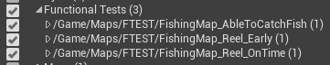

# StairwayFishingGame
This repo contains the source code for a fishing game built using Unreal Engine 4.27 and C++.

## Overview
- Built using Unreal Engine 4.27 and C++
- Separated code into several game and editor modules
- Easily configurable parameters via data assets
- Uses own-developed utilities module backported from UE5.x -> UE4.27:
  - VAAnyUnreal as a container that acts as substitute for STL's std::any for Unreal Engine
  - VAGameplayMessaging module as helper for async message passing via channel (GameplayTag) and payload (VAAnyUnreal)
- Implements a simple game loop where player can :
  - Hold LMB to cast, the longer you held the farther the cast will be and represented by casting meter bar
  - Player throws rod to the location from the earlier cast and lands on the body of water
  - Wait for ~3secs for the fish to reel in and bites the bobber. If the player clicks early, the fish will escape!
  - Reel out the fish
  - And finally show the fish and have a choice to restart or quit the game!
- Added functional tests to test the fishing feature, can be run via session frontend
  - Validates and check if the parameters are set correctly and able to catch any fish
  - Checks if waiting 3s to pull the fish works
  - Checks if reeling out early will not catch the fish works
 

  

## Asset credits
- Fishing rod: https://sketchfab.com/3d-models/fishing-rod-1ffdece4c1054f44b640ef3a189ada09
- Bobber: https://sketchfab.com/3d-models/fishing-bobber-red-white-bf30a035c30340c3a0e3db1c7788a3a5
- Bite sound: https://pixabay.com/sound-effects/carrotnom-92106/
- Bird ambience: https://pixabay.com/sound-effects/bird-voices-7716/
- Water splash sound: https://pixabay.com/sound-effects/fish-splashing-release-1-96870/
- Ocean ambience: https://pixabay.com/sound-effects/ocean-waves-112906/
